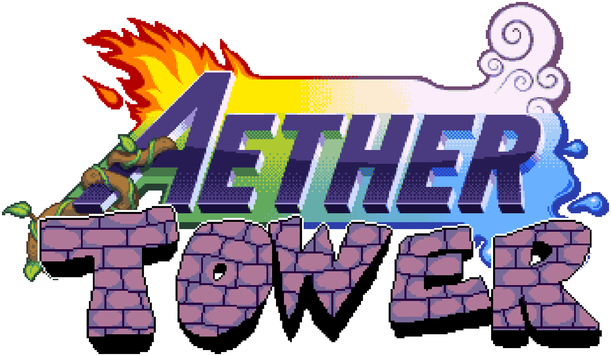

  

  
   
  <em>Click to watch the demo</em>

Aether Tower (or PizzaRivals, or Tower of Aether) is a passthrough mod to let you play **Pizza Tower** as any **Rivals of Aether** character (stock or Workshop), with in-game character switching and full interactions with enemies. Using a similar method to [SkyCraft](https://github.com/chasmlol/SkyCraft) 

Two processes work together:

- **Rivals of Aether** (32-bit) runs the chosen character in a hidden training match. A bridge mod (`roa-bridge/`, loaded by the Rivals of Aether mod loader) feeds it Pizza Tower's input and level geometry and reports the character's state, hitboxes and pixels.
- **Pizza Tower** (64-bit, patched) is the world. `pt-bridge/` holds the GML (`scr_rivals`), a native extension
  (`pizzarivals_pt.dll`) and `install.py`, which patches a decompiled Pizza Tower project.

The two talk through shared memory (`protocol/`). See `docs/DESIGN.md` for the full design.

## Requirements
- [Pizza Tower on Steam](https://store.steampowered.com/app/2231450/Pizza_Tower/)
- [Rivals of Aether on Steam](https://store.steampowered.com/app/383980/Rivals_of_Aether/)
- [roa mod loader](https://github.com/raicool/roa-mod-loader)
- A way to patch xdelta files, such as [DeltaPatcher](https://github.com/marco-calautti/DeltaPatcher) or the [online xdelta patcher](https://kotcrab.github.io/xdelta-wasm/)

## (Release) Installation
### Download the zip file from the releases tab (it's green and on the right side of your screen!)

### Pizza Tower:
- Patch the PTdata.xdelta file onto data.win within your pizza tower local files. The new file also needs to be called data.win, so I suggest naming the original something like "data OG.win" and then patch it.
- To patch it, you can use [DeltaPatcher](https://github.com/marco-calautti/DeltaPatcher), there are [online versions](https://kotcrab.github.io/xdelta-wasm/) too if you don't want to download anything.
- Patch the PTexe.xdelta file onto PizzaTower.exe within your pizza tower local files. The new file also needs to be called PizzaTower.exe, so I suggest naming the original something like "PizzaTower OG.exe" and then patch it.
- Drag and drop "pizzarivals_music.cfg", "pizzarivals_pt.dll" and "pizzarivals_catalog.json" into your local files as well. All of these should be sitting next to the PizzaTower.exe file.

### Rivals of Aether:
- Download and install [roa mod loader](https://github.com/raicool/roa-mod-loader)
- Then place "pizzarivals.dll" within the mods folder.

### DONE!

To play, launch Pizza Tower, and enter the tower, then launch Rivals of Aether. The games should connect and you're good to go. 

## Music
Yes, you can have custom **escape and lap 2 music.** Simply edit the `pizzarivals_music.cfg` config, located in your Pizza Tower install folder, it's very easy, you can tell it to play a song from rivals, or any ogg file on your computer, there are examples in there. I've taken the liberty to add in music for the base cast, workshop characters work as well if you add them.

Songs are exported on your own machine from your own copy of the game (`tools/roa_sounds.py`); nothing copyrighted is in this repo.

## Before You Play + Options

I wanted to run down a few quirks that you should know prior to playing.
- Kragg may encounter a bug with his hitstun being too high sometimes, this mod works by putting the rival deep below the blast zone, but Kragg's upspecial will always bring him to where it thinks the game is taking place, which caused him to always shoot up to the sky, so he's not operating deep below the blast zone, and if he gets to the top blast zone, the game thinks every hit is devastating, but the tradeoff is that his up special works most of the time.
- You can dodge under 1 block gaps, some workshop characters are unable to do this, but I found if you wavedash, you can make it through with the ones that have issues. 
- To progress through levels, you need to hit some things like metal blocks or rats with attacks powerful enough, if your character is a wimp, you can enable WEAK METAL, in the in game Aether Tower settings. 
- To play as a workshop character, or select a skin/alt palette, select WORKSHOP OR SKIN in change character, then back out of the Aether Tower menu. This will open a mini Rivals of Aether window, go to local versus, select your character, then press Y to playtest, the window will automatically hide itself and when you resume the game you can play.
- IF ANYTHING BREAKS, try the Reset options, RESET RIVAL resets the Rivals of Aether match, RESET POSITION, resets the rival to it's pizza tower puppet, incase it ever got desynced. If things really get messed up and you get put out of bounds, try RESET PEPPINO, this invokes the technical difficulties screen, and respawns peppino, and your rival at the last door. 
-  In the ENEMEY CONFIG, I wouldn't recommended changing anything besides PT KILL PERCENT, which is the amount of damage you have to do to to an enemy before you can do your finishing blow on it, which kills it in pizza tower, if you don't want to combo them and have the enemies one and done, set this to 0.
- The whole game is playable from start to finish without peppino, though some characters may struggle with the timer, adjust RIVAL SPEED to whatever feels right. 
- if for some reason you just need to play as Peppino, you can turn RIVALS OFF.
- Some workshop character's have their percent in the wrong places, idk what's up with that. Some workshop projectiles will also not function, because they may break in the blast zone.
- Sometimes you may teleport and get teleported right back, this sucks, but it's what fixed falling out of bounds for the most part.
- Slopes do not exist in rivals, and thus were hard to implement, they work better than you would think, but sometimes you get stuck on the top of one, just jump, it's no big deal. Enemies and projectiles may ignore slopes or treat them as airbone instead of ground. 

## AI 
Yes, this project was vibe coded using Claude Sonnet 5.5 Medium. I did this out of curiosity for those game mashups I've been seeing. **I want to state for the record, that I'm typically against AI, and would never use it for things like images or videos, or any other art where I can reasonably pay someone to achieve it,** but as a miracle machine to combine 2 games in a weekend, yeah, I think it's neat, and theres nothing AI in this project beyond the code. If you yearn for a non-ai campaign in Rivals of Aether, try [Hallowflame](https://steamcommunity.com/sharedfiles/filedetails/?id=2634489514), or fund Rivals 2 Story Mode on [Aether Studio's Patreon](https://www.patreon.com/cw/StudiosofAether). 

### You are free to use this project in any other project you want
## Layout

| Folder | What it is |
| --- | --- |
| `protocol/` | shared-memory protocol header + layout test |
| `roa-bridge/` | RoA-side bridge mod (C++, x86); `build.ps1 -Deploy bridge` builds it and copies it into RoA's `mods` folder |
| `pt-bridge/` | Pizza Tower side: GML, native extension (C++, x64), `install.py` patcher |
| `characters/` | `stock.json`, the music config template; `catalog.json` is generated by `tools/build_catalog.py` |
| `tools/` | build scripts, test harness (`fake_pt`, `roa_test.ps1`), sound extractor (`roa_sounds.py`) |
| `docs/` | design notes |

## What you need (Development)

- Pizza Tower source/project (decompiled) in a working folder, GameMaker (LTS 2022.0.3.99 runtime), Visual Studio C++ build tools, this project used [OpenTower](https://github.com/femloy/OpenTower), by Loypoll
- Rivals of Aether with a mod loader that loads DLLs from its `mods` folder (`roa-bridge/` is built against that loader's headers, expected at `../roa-mod-loader`), and Workshop characters you want
- The scripts contain the author's paths (`C:\pt`, `C:\ptbuild`, `G:\games\steamapps\...`): adjust them for your machine.
  `tools/build_pt.sh` needs `GMS_USER` set to your GameMaker user folder.

## Build, roughly

1. `powershell -File pt-bridge/extension/build.ps1` builds `pizzarivals_pt.dll` (x64).
2. `powershell -File roa-bridge/build.ps1 -Deploy bridge` builds and installs the RoA bridge.
3. `bash tools/build_pt.sh` patches the Pizza Tower project (`install.py`), compiles it and runs it.
4. `tools/play.ps1` starts Pizza Tower, then Rivals of Aether.

In game: pause menu -> **AETHER TOWER** for the character, speed, resets and enemy options.
Settings are saved to `pizzarivals_settings.ini` in Pizza Tower's save folder.

# Rivals of Aether and Pizza Tower belong to their respective owners; this is an unofficial fan project.
